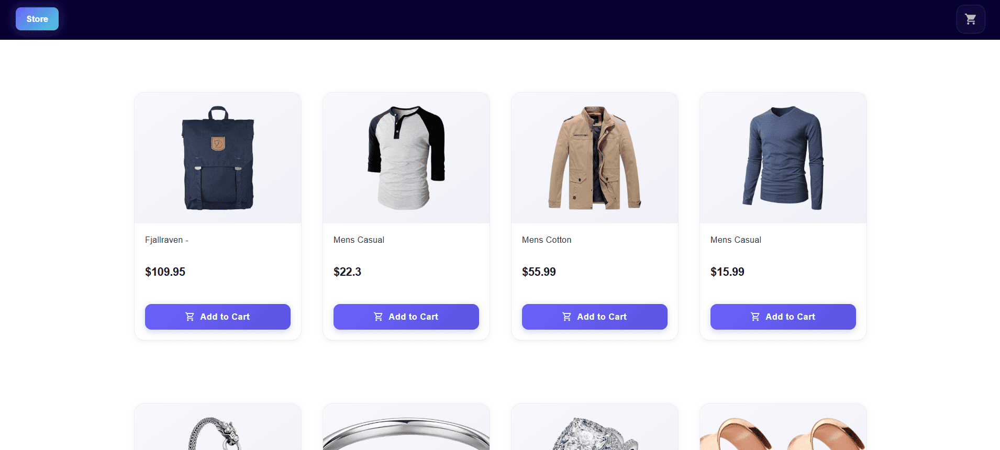
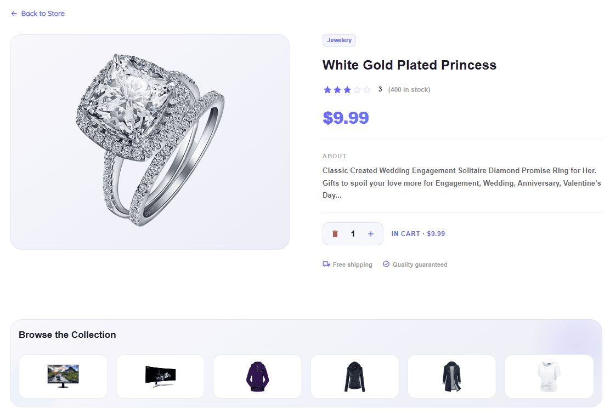
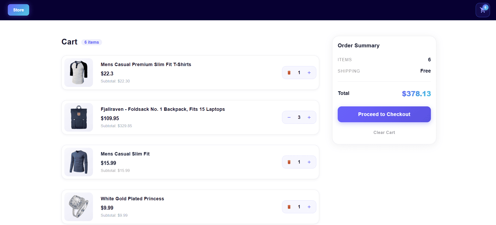

# React Shopping Store Website

A fully functional e-commerce frontend built with React. This project allows users to browse products, view details, and manage a shopping cart in a responsive and visually appealing interface.

## 🚀 Live Demo

[View the live demo here](https://react-shopping-store-website.netlify.app/)


## 📁 Folder Structure

```
React-Shopping-store-website/
├── package.json
├── public/
│   ├── _redirects
│   └── index.html
├── src/
│   ├── App.jsx
│   ├── index.js
│   ├── assets/
│   │   ├── styles/
│   │   │   ├── index.scss
│   │   │   ├── components/
│   │   │   │   └── _shopCard.scss
│   │   │   └── global/
│   │   │       ├── _fonts.scss
│   │   │       ├── _loader.scss
│   │   │       ├── _reset.scss
│   │   │       ├── _scrollbar.scss
│   │   │       ├── _swal.scss
│   │   │       └── _swiper.scss
│   ├── components/
│   │   ├── common/
│   │   │   ├── Loading.jsx
│   │   │   └── Products.jsx
│   │   └── Layout/
│   │       ├── Header.js
│   │       └── index.js
│   ├── contexts/
│   │   ├── CardContextProvider.js
│   │   └── ProductContextProvider.js
│   ├── helper/
│   │   └── functions.js
│   ├── pages/
│   │   ├── product-details/
│   │   │   ├── index.jsx
│   │   │   └── components/
│   │   │       ├── Banner.jsx
│   │   │       ├── ProductDetailsSkeleton.jsx
│   │   │       └── ProductInfo.jsx
│   │   ├── products/
│   │   │   └── index.jsx
│   │   └── shopping-card/
│   │       ├── index.jsx
│   │       └── components/
│   │           ├── BackLink.jsx
│   │           ├── Card.jsx
│   │           ├── CartList.jsx
│   │           ├── EmptyCartState.jsx
│   │           ├── OrderSummary.jsx
│   │           ├── StatRow.jsx
│   │           └── SuccessCartState.jsx
│   ├── services/
│   │   ├── getAllProducts.js
│   │   ├── getSingleProducts.js
│   │   └── http.js
```

## 🖼️ Project Screenshots





## 📖 Description

This React application consumes a product API and allows users to:

- View a list of products
- Inspect detailed information for each item
- Add/remove products to/from a shopping cart
- See a summary of cart totals

The app uses context providers for state management and makes HTTP requests through a centralized service module.

## 🛠️ Technologies

- React (Functional components with hooks)
- Context API for global state
- SCSS & MUI for styling
- Custom services for data fetching

## 📦 Installation

```bash
npm install
npm start
```

## ✨ Contribution

Feel free to open issues or submit pull requests to improve the project.

---

_Developed by [Parham Abolghasemi](https://github.com/parham-ab)_
